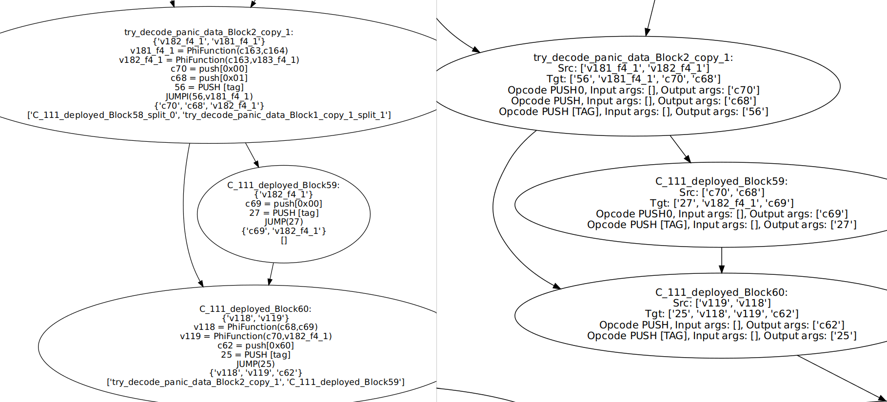
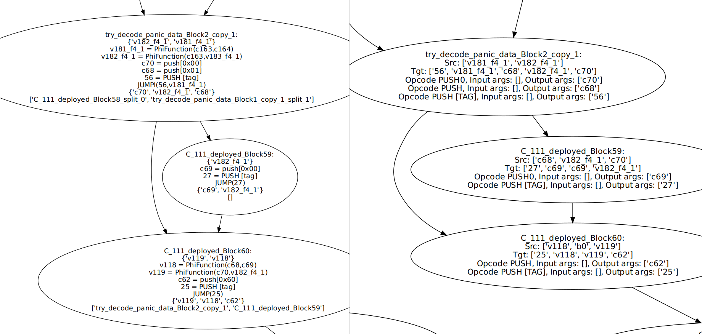

# Stack Brothers Unification (23/01/2025)

## Command to reproduce the issue: 
```
/home/alejandro/repos/green/venv/bin/python3 /home/alejandro/repos/grey/src/grey_main.py -s examples/test/semanticTests/tryCatch_panic/panic_standard_input.json -g -v -if standard-json -o falla -solc ./solc-objects 
```

The issue with the function `unify_stack_brothers` occurs when a stack variable is used both as part of a phi function and remains live in another block (which is not associated with that phi function). Consider the following example:



On the left, the information from the liveness analysis is displayed. On the right, the generated layouts are shown. Stack value `v_182_f4_1` is passed in the expression `PhiFunction(c70, v_182_f4_1)` by block `C_111_deployed_Block59`, but it must have been passed previously by `try_decode_panic_data_Block2_copy_1`. However, the previous algorithm didn’t consider this variable when generating the combined stack. The problem is that PhiFunctions are identified by the variable they are assigned, so the algorithm mistakenly assumed that `v_182_f4_1` didn’t need to be passed to `C_111_deployed_Block59` because it was being passed as `c_70`. This caused block `C_111_deployed_Block59` to have this value in its output stack with no operation to introduce it. The fix involved linking the variables in the `PhiFunction` with the block that introduced them so that it was possible to identify that `v_182_f4_1` had to be considered when generating the combined stack. You can see the fixed result in


